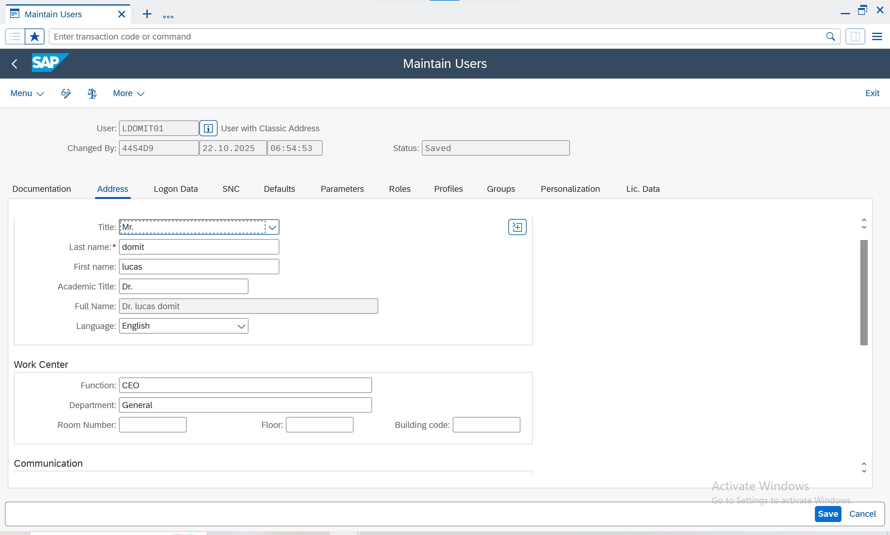
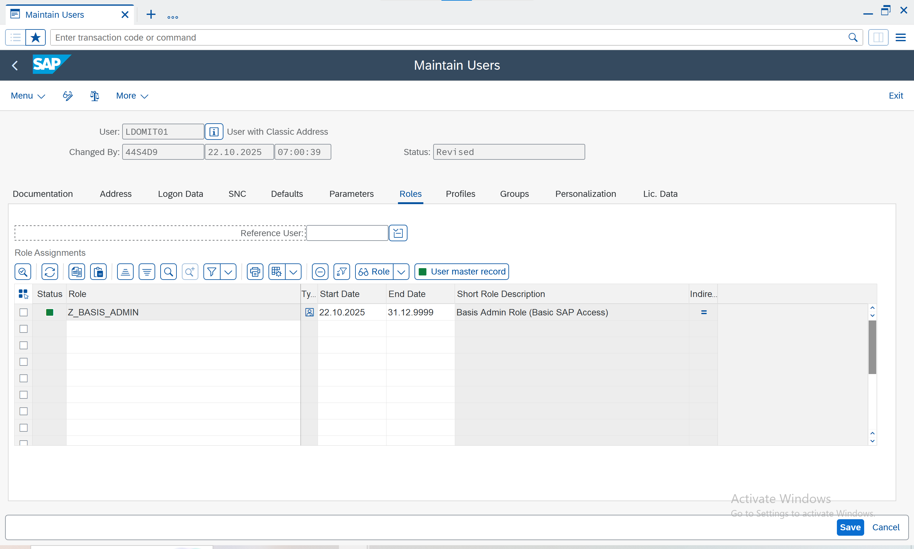
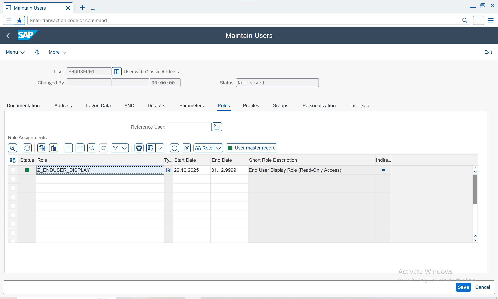
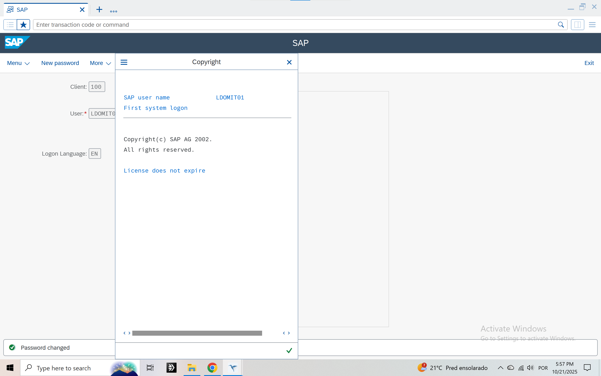
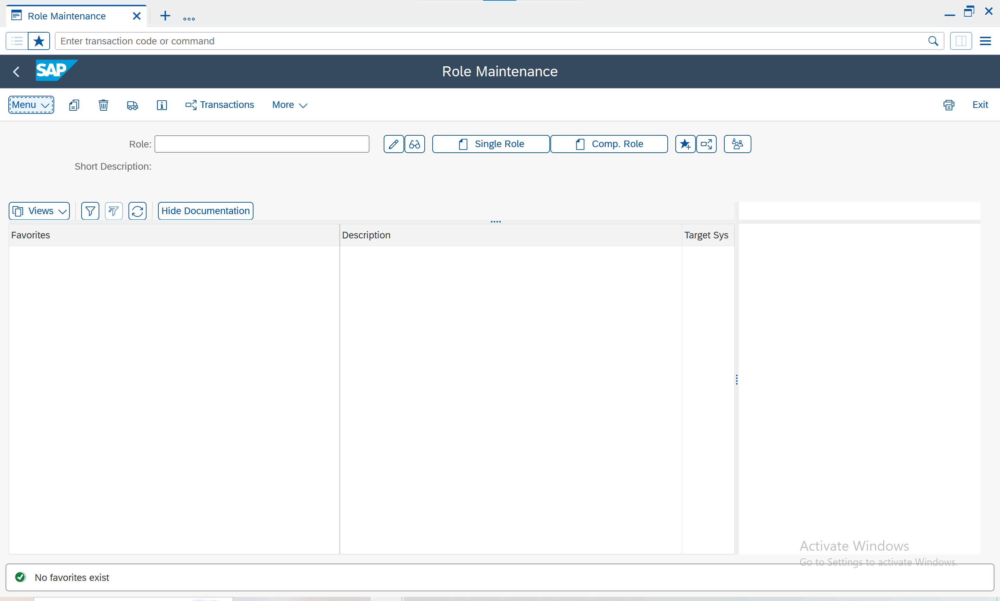
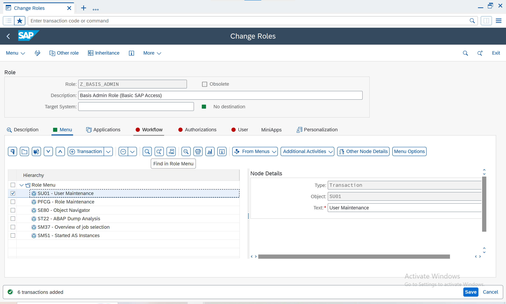
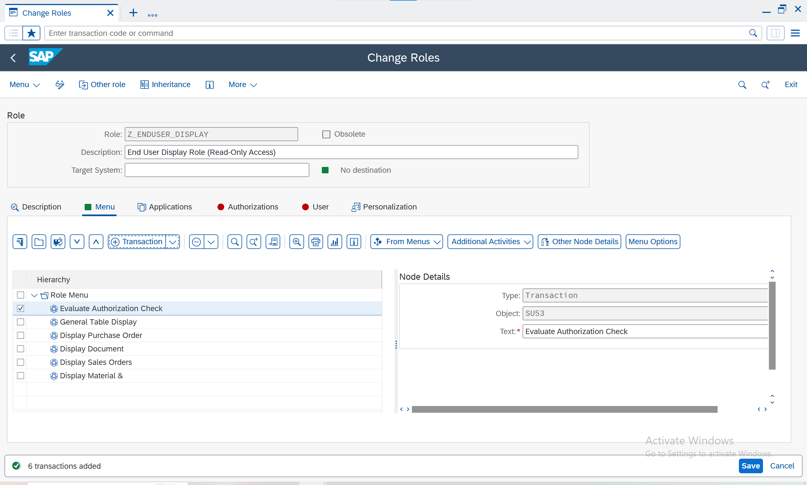
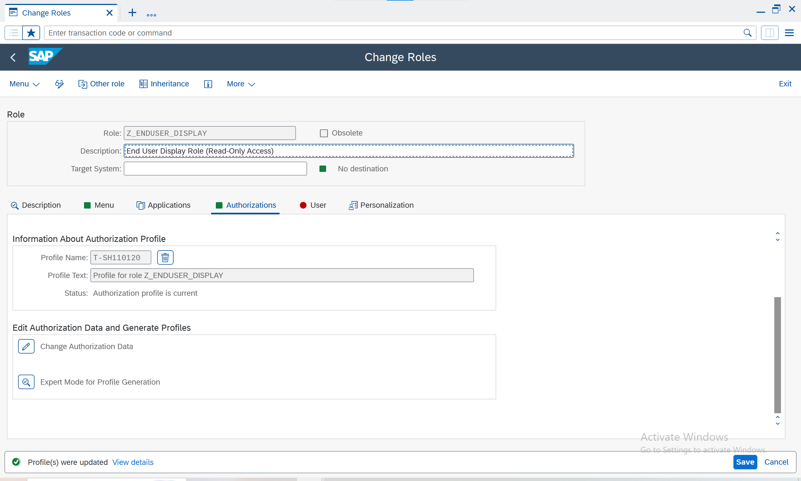

# 🧙️ SAP User Creation Guide

Comprehensive technical walkthrough showing **how to create and manage SAP users and roles (SU01, PFCG, SU10)** in an SAP ABAP system — including screenshots, security notes, and role configuration examples.

---

## 📘 Overview

This repository documents, in detail, the **manual creation of users and roles** inside an SAP environment.
It is intended for:

* SAP Basis & Security trainees
* System administrators
* Anyone practicing SAP GRC / user governance

> 🗂️ Repository structure
>
> * `/screenshots/` → All captured images (SU01, PFCG steps)
> * `/pdf/` → Full compiled PDF
> * `*.md` → Individual documentation sections

---

## 🔧 System Requirements

* SAP GUI 7.70 or later
* Access to SAP system (Developer or Sandbox)
* Authorizations for:

  ```
  SU01
  SU10
  PFCG
  SUIM
  ST22
  SM37
  SE80
  ```

---

## 🧬 Table of Contents

1. Introduction (01-introduction.md)
2. User Creation — SU01 (02-user-creation-SU01.md)
3. Roles and Profiles — PFCG (03-roles-and-profiles.md)
4. Security Best Practices (04-security-best-practices.md)
5. Mass User Creation — SU10 (05-automation-SU10.md)

---

## 📡 Screenshots

### 🔹 SU01 – User Maintenance

**Create User**


**Address Tab**


**Logon Data**


**Role Assigned**


**User Reassigned (Enduser Test)**


**Login Success**


**Overview**


---

### 🔹 PFCG – Role Maintenance

**Initial Screen**


**Create Role**


**Menu Tab**


**Authorizations**


**Profile Generated**


---

### 🔹 Z_ENDUSER_DISPLAY – Read-Only Role

**Create Role**


**Menu Setup**


**Profile Generated**


**Login Test**


---

### 🔹 SAP GUI Overview


---

## 🔐 Author

**👤 Lucas Domit**
SAP GRC | SAP Security | Technical Consultant
📧 [lucasdomit@gmail.com](mailto:lucasdomit@gmail.com)

---

## 🔖 PDF Version

A printable version of this guide is available here:
👉 [SAP_User_Creation_Guide.pdf](pdf/SAP_User_Creation_Guide.pdf)

---

## 💡 Contribute

Feel free to fork this repo, submit improvements, or translate the documentation into other languages.
Pull requests are welcome!

---

## 📄 License

This guide is released under the **MIT License** — you are free to reuse and modify it with credit.
