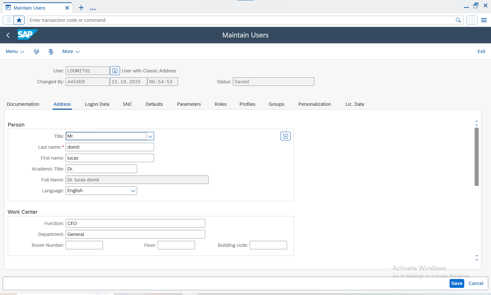
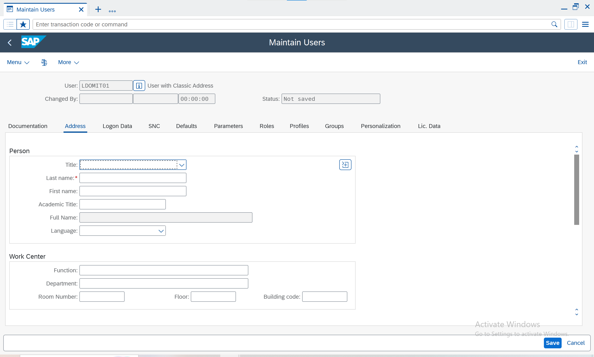
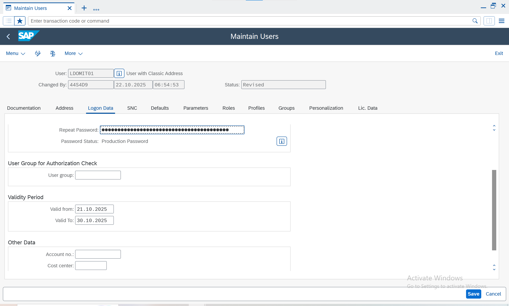
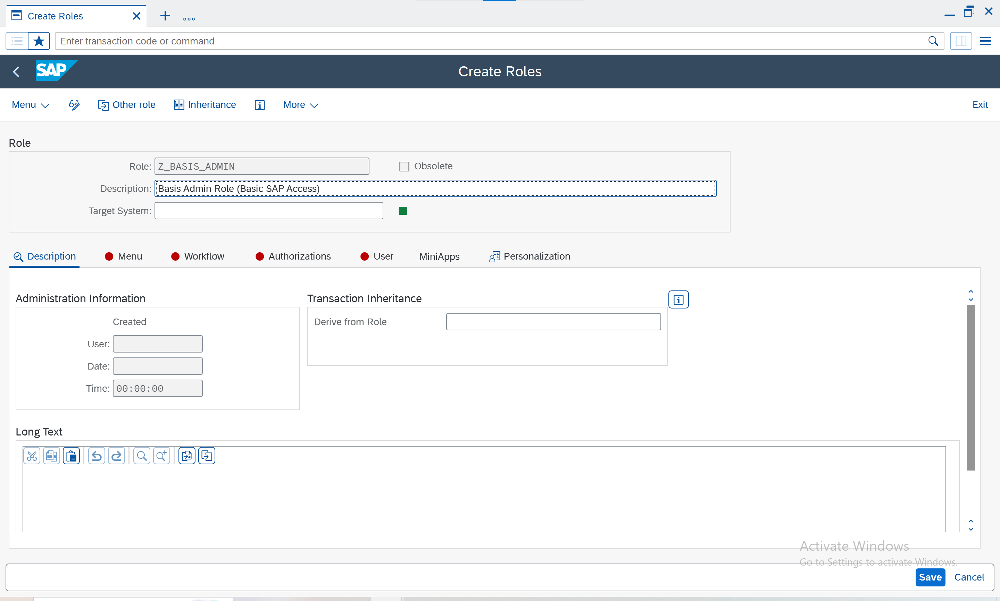
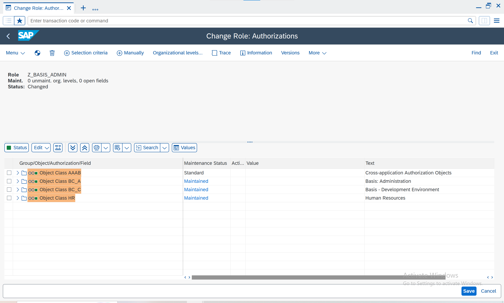
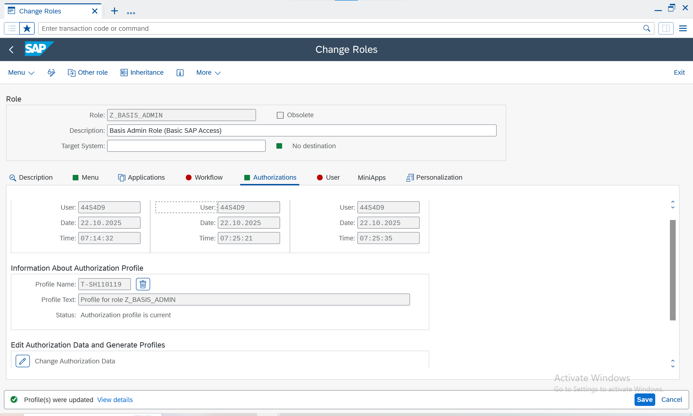
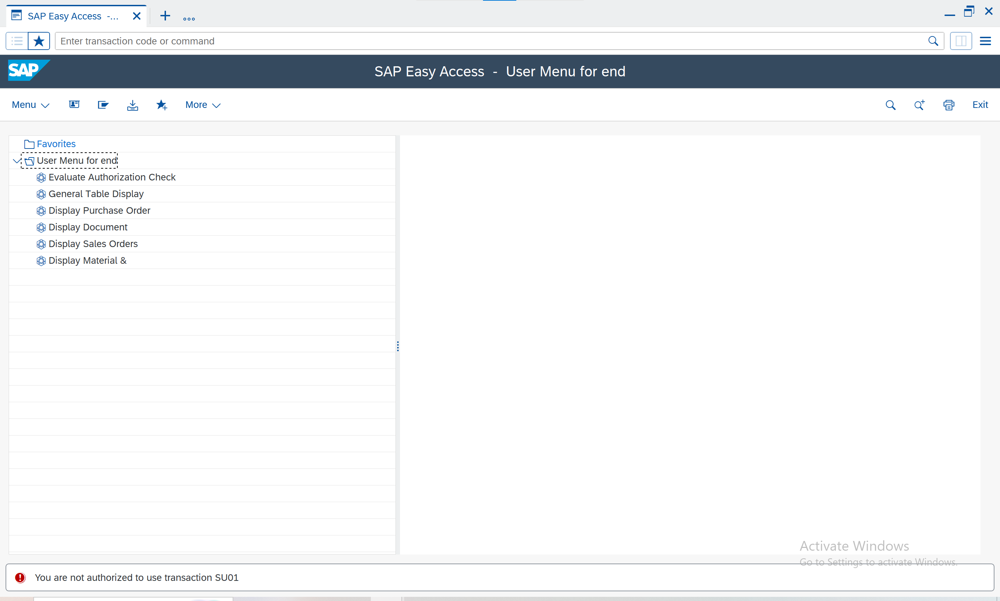

# 🧩 SAP Security & GRC Portfolio — Lucas Domit

This repository demonstrates **professional-level SAP Security and GRC knowledge**, including user and role management, authorization concept, audit configuration, and integration with SAP GRC Access Control.

## 📘 Overview
This documentation provides a structured, technical overview designed for SAP Basis & Security professionals. It showcases mastery of user administration, authorization management, and compliance controls in SAP S/4HANA and GRC.

### 📂 Folder Structure
```
sap-skills-pro/
├── 01-sap-security-architecture.md
├── 02-user-master-data.md
├── 03-role-concept-pfcg.md
├── 04-authorization-objects.md
├── 05-transport-and-troubleshooting.md
├── 06-sap-grc-integration.md
├── 07-security-audit.md
├── 08-abap-scripts-and-tables.md
├── pdf/SAP_Security_Guide.pdf
└── screenshots/
```

### 🧠 Author
**Lucas Domit**  
SAP Security | GRC Access Control | Basis Technical Consultant  
📧 [lucasdomit@gmail.com](mailto:lucasdomit@gmail.com)

---

## 🔐 Topics Covered
- SAP User & Role Administration (SU01, PFCG, SU10, SUIM)
- Role and Authorization Object Design (AGR_*, USR_* tables)
- Role Transport Management (STMS, SCUL)
- GRC Access Control (Risk Analysis & Remediation)
- Security Audit Logs (SM19, SM20, SUIM)
- Troubleshooting and Best Practices

---

## 🖼️ Screenshots

### 🔹 SU01 – User Maintenance
**Overview**


**Create User**


**Logon Data**


---

### 🔹 PFCG – Role Maintenance
**Create Role**


**Authorization Maintenance**


**Profile Generated**


---

### 🔹 End User Role Test
**Login as ENDUSER01**


---

### 🔹 SAP GUI Overview

